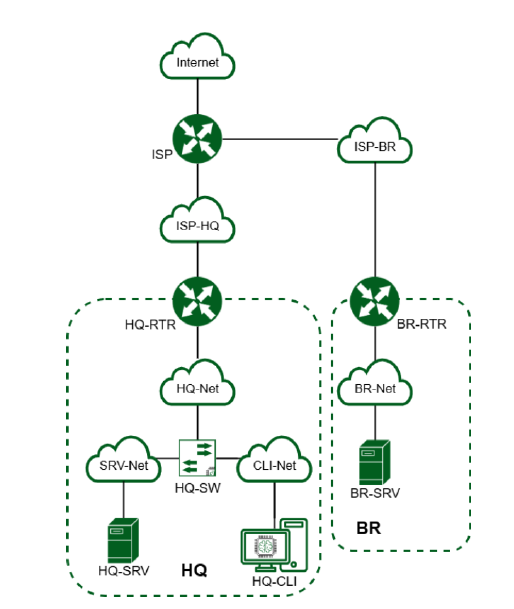

# Образец задания для ГИА ДЭ ПУ (инвариантная часть)

## Модуль 1. Настройка сетевой инфраструктуры

Необходимо разработать и настроить инфраструктуру информационно-коммуникационной системы согласно предложенной топологии (см. Рисунок 1)

Задание включает базовую настройку устройств:
- присвоение имен устройствам
- расчет IP-адресации
- настройку коммутации и маршрутизации

В ходе проектирования и настройки сетевой инфраструктуры следует вести отчет о своих действиях, включая таблицы и схемы, предусмотренные в задании

По каждому пункту задания, требующего отчёт, составить текстовый документ, название которого должно содержать индекс пункта и краткое описание. Текстовый документ должен содержать текстовую информацию и может включать снимки экрана, кадрированные таким образом, чтобы относящаяся к выполнению задания информация на снимках была читаемой.

Итоговый отчет по окончании работы следует сохранить на диске рабочего места и задать имя файла - ФамилияУчастникаМодуль1 без учёта расширения

Топология сети

Таблица 1

| Имя виртуальной машины | Оперативная память | Центральный процессор, ядер | Накопитель | Операционная система |
|------------------------|---------------------|------------------------------|------------|-----------------------|
| ISP | 1 Гб | 1 ядро | 5 Гб | Дистрибутив Альт JeOS или аналог |
| HQ-RTR | 4 Гб в случае использования EcoRouter 1 Гб в случае использования дистрибутива Linux | 4 ядра в случае использования EcoRouter 1 ядро в случае использования дистрибутива Linux | 10 Гб | ОС EcoRouter, в случае невозможности использования EcoRouter дистрибутив Альт JeOS или аналог |
| BR-RTR | 4 Гб в случае использования EcoRouter 1 Гб в случае использования дистрибутива Linux | 4 ядра в случае использования EcoRouter 1 ядро в случае использования дистрибутива Linux | 10 Гб | ОС EcoRouter, в случае невозможности использования EcoRouter дистрибутив Альт JeOS или аналог |
| HQ-SRV | 2 Гб | 1 ядро | 10 Гб | ОС Альт сервер или аналог |
| BR-SRV | 2 Гб | 1 ядро | 10 Гб | ОС Альт сервер или аналог |
| HQ-CLI | 2 Гб | 2 ядра | 15 Гб | ОС Альт рабочая станция или аналог |
| Итого | 15 (9 в случае использования ОС Альт или аналога) | 13 (7 в случае использования ОС Альт или аналога) | 60 Гб |  |

Задание модуль 1

1. Произведите базовую настройку устройств:  
   • Настройте имена устройств согласно топологии. Используйте полное доменное имя  
   • На всех устройствах необходимо сконфигурировать IPv4:  
   • IP-адрес должен быть из приватного диапазона, в случае, если сеть локальная, согласно RFC1918  
   • Локальная сеть в сторону HQ-SRV(VLAN 510) должна вмещать не более 16 адресов  
   • Локальная сеть в сторону HQ-CLI(VLAN 520) должна вмещать не менее 32 адресов  
   • Локальная сеть для управления(VLAN 599) должна вмещать не более 16 адресов  
   • Локальная сеть в сторону BR-SRV должна вмещать не более 16 адресов  
   • Сведения об адресах занесите в таблицу 2, в качестве примера используйте Прил_3_О1_КОД 09.02.06-1-2026-М1  

2. Настройте доступ к сети Интернет, на маршрутизаторе ISP:  
   • Настройте адресацию на интерфейсах:  
   • Интерфейс, подключенный к магистральному провайдеру, получает адрес по DHCP  
   • Настройте маршрут по умолчанию, если это необходимо  
   • Настройте интерфейс, в сторону HQ-RTR, интерфейс подключен к сети 172.16.1.0/28  
   • Настройте интерфейс, в сторону BR-RTR, интерфейс подключен к сети 172.16.2.0/28  
   • На ISP настройте динамическую сетевую трансляцию портов для доступа к сети Интернет HQ-RTR и BR-RTR.  

3. Создайте локальные учетные записи на серверах HQ-SRV и BR-SRV:  
   • Создайте пользователя flow_ctrl  
   • Пароль пользователя flow_ctrl с паролем PhotonBeam  
   • Идентификатор пользователя 2014  
   • Пользователь flow_ctrl должен иметь возможность запускать sudo без ввода пароля  

4. Настройте коммутацию в сегменте HQ следующим образом:  
   • Трафик HQ-SRV должен принадлежать VLAN 510  
   • Трафик HQ-CLI должен принадлежать VLAN 520  
   • Предусмотреть возможность передачи трафика управления в VLAN 599  
   • Реализовать на HQ-RTR маршрутизацию трафика всех указанных VLAN с использованием одного сетевого адаптера ВМ/физического порта  
   • Сведения о настройке коммутации внесите в отчёт  

5. Настройте безопасный удаленный доступ на серверах HQ-SRV и BR-SRV:  
   • Для подключения используйте порт 2214  
   • Разрешите подключения исключительно пользователю flow_ctrl  
   • Ограничьте количество попыток входа до 3  
   • Настройте баннер «Authorized access only».  

6. Между офисами HQ и BR, на маршрутизаторах HQ-RTR и BR-RTR необходимо сконфигурировать ip туннель:  
   • На выбор технологии GRE или IP in IP  
   • Сведения о туннеле занесите в отчёт.  

7. Обеспечьте динамическую маршрутизацию на маршрутизаторах HQ-RTR и BR-RTR: сети одного офиса должны быть доступны из другого офиса и наоборот. Для обеспечения динамической маршрутизации используйте link state протокол на усмотрение участника:  
   • Разрешите выбранный протокол только на интерфейсах ip туннеля  
   • Маршрутизаторы должны делиться маршрутами только друг с другом  
   • Обеспечьте защиту выбранного протокола посредством парольной защиты  
   • Сведения о настройке и защите протокола занесите в отчёт.  

8. Настройка динамической трансляции адресов маршрутизаторах HQ-RTR и BR-RTR:  
   • Настройте динамическую трансляцию адресов для обоих офисов в сторону ISP, все устройства в офисах должны иметь доступ к сети Интернет  

9. Настройте протокол динамической конфигурации хостов для сети в сторону HQ-CLI:  
   • Настройте нужную подсеть  
   • В качестве сервера DHCP выступает маршрутизатор HQ-RTR  
   • Клиентом является машина HQ-CLI  
   • Исключите из выдачи адрес маршрутизатора  
   • Адрес шлюза по умолчанию – адрес маршрутизатора HQ-RTR  
   • Адрес DNS-сервера для машины HQ-CLI – адрес сервера HQ-SRV  
   • DNS-суффикс – net14tech.institute  
   • Сведения о настройке протокола занесите в отчёт.  

10. Настройте инфраструктуру разрешения доменных имён для офисов HQ и BR:  
    • Основной DNS-сервер реализован на HQ-SRV  
    • Сервер должен обеспечивать разрешение имён в сетевые адреса устройств и обратно в соответствии с таблицей 3  
    • В качестве DNS сервера пересылки используйте любой общедоступный DNS сервер(77.88.8.7, 77.88.8.3 или другие)  

11. Настройте часовой пояс на всех устройствах (за исключением виртуального коммутатора, в случае его использования) согласно месту проведения экзамена  

Таблица 2

| Имя устройства | IP-адрес | Шлюз по умолчанию |
|----------------|----------|-------------------|
| HQ-RTR |  |  |
| BR-RTR |  |  |
| HQ-SRV |  |  |
| HQ-CLI |  |  |
| BR-SRV |  |  |

Таблица 3

| Устройство | Запись | Тип |
|------------|--------|-----|
| HQ-RTR | hq-rtr.net14tech.institute | A,PTR |
| BR-RTR | br-rtr.net14tech.institute | A |
| HQ-SRV | hq-srv.net14tech.institute | A,PTR |
| HQ-CLI | hq-cli.net14tech.institute | A,PTR |
| BR-SRV | br-srv.net14tech.institute | A |
| ISP (интерфейс направленный в сторону HQ-RTR) | docker.net14tech.institute | A |
| ISP (интерфейс направленный в сторону BR-RTR) | web.net14tech.institute | A |

Необходимые приложения:  
Прил_1_О1_КОД 09.02.06-1-2026-М1: Шаблон отчета  
Прил_2_О1_КОД 09.02.06-1-2026-М1: Инструкция по настройке оборудования для технического эксперта ДЭ  
Прил_3_О1_КОД 09.02.06-1-2026-М1: Пример заполнения таблицы адресов  
Прил_4_О1_КОД 09.02.06-1-2026-М1: Инструкции по оформлению отчёта  

Необходимые приложения:  
Прил_3_ОЗ_КОД 09.02.06-1-2026-М1.docx  
Прил_4_ОЗ_КОД 09.02.06-1-2026-М1.docx  
Прил_1_ОЗ_КОД 09.02.06-1-2026-М1.docx  
Прил_2_ОЗ_КОД 09.02.06-1-2026-М1.docx  

Инструкции для ТЭ: Инструкция для технического администратора размещена в приложении

## Модуль 2. Организация сетевого администрирования

Необходимо разработать и настроить инфраструктуру информационно-коммуникационной системы согласно предложенной топологии (см. Рисунок 2).

По каждому пункту задания, требующего отчёт, составить текстовый документ, название которого должно содержать индекс пункта и краткое описание.

Итоговый отчет по окончании работы следует сохранить на диске рабочего места и задать имя файла - ФамилияУчастникаМодуль2 без учёта расширения

Задание модуль 2

1. Настройте контроллер домена Samba DC на сервере BR-SRV:  
   • Имя домена net14tech.institute  
   • Введите в созданный домен машину HQ-CLI  
   • Создайте 5 пользователей для офиса HQ: имена пользователей формата hquserNo (например operator1, operator2 и т.д.)  
   • Создайте группу hq, введите в группу созданных пользователей  
   • Убедитесь, что пользователи группы hq имеют право аутентифицироваться на HQ-CLI  
   • Пользователи группы hq должны иметь возможность повышать привилегии для выполнения ограниченного набора команд: cat, grep, id. Запускать другие команды с повышенными привилегиями пользователи группы права не имеют.  

2. Сконфигурируйте файловое хранилище на сервере HQ-SRV:  
   • При помощи двух подключенных к серверу дополнительных дисков размером 1 Гб сконфигурируйте дисковый массив уровня 1  
   • Имя устройства – md0, при необходимости конфигурация массива размещается в файле /etc/mdadm.conf  
   • Создайте раздел, отформатируйте раздел, в качестве файловой системы используйте ext4  
   • Обеспечьте автоматическое монтирование в папку /raid  

3. Настройте сервер сетевой файловой системы (nfs) на HQ-SRV:  
   • В качестве папки общего доступа выберите /raid/nfs, доступ для чтения и записи исключительно для сети в сторону HQ-CLI  
   • На HQ-CLI настройте автомонтирование в папку /mnt/nfs  
   • Основные параметры сервера отметьте в отчёте  

4. Настройте службу сетевого времени на базе сервиса chrony на маршрутизаторе ISP:  
   • Вышестоящий сервер ntp на маршрутизаторе ISP - на выбор участника  
   • Стратум сервера - 3  
   • В качестве клиентов ntp настройте: HQ-SRV, HQ-CLI, BR-RTR, BR-SRV.  

5. Сконфигурируйте ansible на сервере BR-SRV:  
   • Сформируйте файл инвентаря, в инвентарь должны входить HQ-SRV, HQ-CLI, HQ-RTR и BR-RTR  
   • Рабочий каталог ansible должен располагаться в /etc/ansible  
   • Все указанные машины должны без предупреждений и ошибок отвечать pong на команду ping в ansible посланную с BR-SRV.  

6. Разверните веб приложение в docker на сервере BR-SRV:  
   • Средствами docker должен создаваться стек контейнеров с веб приложением и базой данных  
   • Используйте образы site_latest и mariadb_latest располагающиеся в директории docker в образе Additional.iso  
   • Основной контейнер testapp должен называться tespapp  
   • Контейнер с базой данных должен называться db  
   • Импортируйте образы в docker, укажите в yaml файле параметры подключения к СУБД, имя БД - testdb, пользователь test с паролем P@ssw0rd, порт приложения 8080, при необходимости другие параметры  
   • Приложение должно быть доступно для внешних подключений через порт 8114  

7. Разверните веб приложение на сервере HQ-SRV:  
   • Используйте веб-сервер apache  
   • В качестве системы управления базами данных используйте mariadb  
   • Файлы веб приложения и дамп базы данных находятся в директории web образа Additional.iso  
   • Выполните импорт схемы и данных из файла dump.sql в базу данных webdb  
   • Создайте пользователя web с паролем P@ssw0rd и предоставьте ему права доступа к этой базе данных  
   • Файлы index.php и директорию images скопируйте в каталог веб сервера apache  
   • В файле index.php укажите правильные учётные данные для подключения к БД  
   • Запустите веб сервер и убедитесь в работоспособности приложения  
   • Основные параметры отметьте в отчёте  

8. На маршрутизаторах сконфигурийте статическую трансляцию портов:  
   • Пробросьте порт 8114 в порт приложения testapp BR-SRV на маршрутизаторе BR-RTR, для обеспечения работы приложения testapp извне  
   • Пробросьте порт 8114 в порт веб приложения на HQ-SRV на маршрутизаторе HQ-RTR, для обеспечения работы веб приложения извне  
   • Пробросьте порт 2214 на маршрутизаторе HQ-RTR в порт 2214 сервера HQ-SRV, для подключения к серверу по протоколу ssh из внешних сетей  
   • Пробросьте порт 2214 на маршрутизаторе BR-RTR в порт 2214 сервера BR-SRV, для подключения к серверу по протоколу ssh из внешних сетей.  

9. Настройте веб-сервер nginx как обратный прокси-сервер на ISP  
   • При обращении по доменному имени web.net14tech.institute у клиента должно открываться веб приложение на HQ-SRV  
   • При обращении по доменному имени docker.net14tech.institute клиента должно открываться веб приложение testapp  
   • Перенастройте ранее настроенный реверсивный прокси nginx на протокол https  (перенесено из модуля 3, но в модуле 2)  

10. На маршрутизаторе ISP настройте web-based аутентификацию:  
    • При обращении к сайту web.net14tech.institute клиенту должно быть предложено ввести аутентификационные данные  
    • В качестве логина для аутентификации выберите WEB с паролем P@ssw0rd  
    • Выберите файл /etc/nginx/.htpasswd в качестве хранилища учётных записей  
    • При успешной аутентификации клиент должен перейти на веб сайт.  

11. Удобным способом установите приложение Яндекс Браузер на HQ-CLI  
    • Установку браузера отметьте в отчёте.  

Необходимые приложения:  
Прил_5_ОЗ_КОД 09.02.06-1-2026-М2.txt  

Инструкции для ТЭ: Инструкция для технического администратора размещена в приложении

## Модуль 3. Эксплуатация объектов сетевой инфраструктуры

Необходимо разработать и настроить инфраструктуру информационно-коммуникационной системы согласно предложенной топологии (см. Рисунок 3).

В ходе проектирования и настройки сетевой инфраструктуры следует заносить записи в отчет о своих действиях, когда это требуется в задании.

Отчет по окончании работы следует сохранить на диске рабочего места и задать имя файла без учёта расширения - ФамилияУчастникаМодуль3

Задание модуль 3

1. Выполните импорт пользователей в домен net14tech.institute:  
   • В качестве файла источника выберите файл users.csv располагающийся в образе Additional.iso  
   • Пользователи должны быть импортированы со своими паролями и другими атрибутами  
   • Убедитесь, что импортированные пользователи могут войти на машину HQ-CLI  

2. Выполните настройку центра сертификации на базе HQ-SRV:  
   • Необходимо использовать отечественные алгоритмы шифрования  
   • Сертификаты выдаются на 30 дней  
   • Обеспечьте доверие сертификату для HQ-CLI  
   • Выдайте сертификаты веб серверам  
   • Перестройте ранее настроенный реверсивный прокси nginx на протокол https  
   • При обращении к веб серверам https://web.net14tech.institute и https://docker.net14tech.institute у браузера клиента не должно возникать предупреждений.  

3. Перенастройте ip-туннель с базового до уровня туннеля, обеспечивающего шифрование трафика  
   • Настройте защищенный туннель между HQ-RTR и BR-RTR  
   • Внесите необходимые изменения в конфигурацию динамической маршрутизации, протокол динамической маршрутизации должен возобновить работу после перенастройки туннеля  
   • Выбранное программное обеспечение, обоснование его выбора и его основные параметры, изменения в конфигурации динамической маршрутизации отметьте в отчёте.  

4. Настройте межсетевой экран на маршрутизаторах HQ-RTR и BR-RTR на сеть в сторону ISP  
   • Обеспечьте работу протоколов http, https, dns, ntp, icmp или дополнительных нужных протоколов  
   • Запретите остальные подключения из сети Интернет во внутреннюю сеть.  

5. Настройте принт-сервер cups на сервере HQ-SRV:  
   • Опубликуйте виртуальный pdf-принтер  
   • На клиенте HQ-CLI подключите виртуальный принтер как принтер по умолчанию.  

6. Реализуйте логирование при помощи rsyslog на устройствах HQ-RTR, BR-RTR, BR-SRV:  
   • Сервер сбора логов расположен на HQ-SRV, убедитесь, что сервер не является клиентом самому себе  
   • Приоритет сообщений должен быть не ниже warning  
   • Все журналы должны находиться в директории /opt. Для каждого устройства должна выделяться своя поддиректория, которая совпадает с именем машины  
   • Реализуйте ротацию собранных логов на сервере HQ-SRV:  
   • Ротируются все логи, находящиеся в директории и поддиректориях /opt  
   • Ротация производится один раз в неделю  
   • Логи необходимо сжимать  
   • Минимальный размер логов для ротации – 24МБ.  

7. На сервере HQ-SRV реализуйте мониторинг устройств с помощью открытого программного обеспечения  
   • Обеспечьте доступность по URL - http://mon.net14tech.institute для сетей офиса HQ, внесите изменения в инфраструктуру разрешения доменных имён  
   • Мониторить нужно устройства HQ-SRV и BR-SRV  
   • В мониторинге должны визуально отображаться нагрузка на ЦП, объем занятой ОП и основного накопителя  
   • Логин и пароль для службы мониторинга admin P@ssw0rd  
   • Организуйте доступ к мониторингу для HQ-CLI, без внешнего доступа  

8. Реализуйте механизм инвентаризации машин HQ-SRV и HQ-CLI через Ansible на BR-SRV:  
   • Плейбук должен собирать информацию о рабочих местах:  
   • Имя компьютера  
   • IP-адрес компьютера  
   • Плейбук, должен быть размещен в директории /etc/ansible, отчёты в поддиректории PC-INFO, в формате .yml. Файлы должны называться именем компьютера, который был инвентаризирован  
   • Файл плейбука располагается в образе Additional.iso в директории playbook  

9. На HQ-SRV настройте программное обеспечение fail2ban для защиты ssh  
   • Укажите порт ssh  
   • При 3 неуспешных авторизациях адрес атакующего попадает в бан  
   • Бан производится на 1 минуту  

10. Настройка резервного копирования директории сервера HQ-SRV:  
    • На HQ-SRV развернуть программное обеспечение для резервного копирования и восстановления данных с защитой от вирусов-шифровальщиков  
    • В качестве решения рекомендуется использовать программное обеспечение Кибер Бэкап версии 17.4 или аналог  
    • Настройте организацию irpo  
    • Настройте пользователя с правами администратора на сервере HQ-SRV, имя пользователя irpoadmin с паролем P@ssw0rd  
    • Установите на HQ-CLI агент с функциями узла хранилища и подключите его к серверу управления  
    • На узле хранилища HQ-CLI создайте директорию /backup и выберите её в качестве устройства хранения  
    • Создайте два плана резервного копирования для сервера HQ-SRV  
    • план для резервного копирования директории /etc и всех её поддиректорий  
    • план для резервного копирования базы данных webdb типа mysql  
    • Выполните резервное копирование директории /etc и всех её поддиректорий сервера HQ-SRV на узел хранения HQ-CLI  
    • Выполните резервное копирование базы данных webdb сервера HQ-SRV на узел хранения HQ-CLI  

Необходимые приложения:  
Прил_6_ОЗ_КОД 09.02.06-1-2026-М3.txt

(Таблицы для модуля 3 не включены, так как аналогичны модулю 1 и 2)
